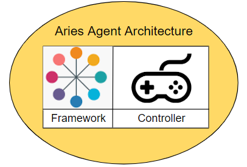
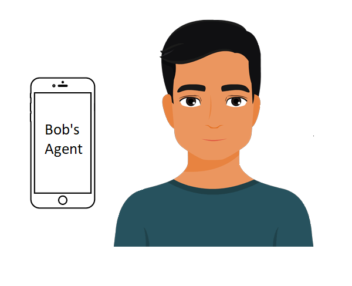

# MNNU-Agent Python
This repository contains all the modules and tools needed to setup one or multiple cloud based agent containers.

#
## What is an agent? 
An agent is a piece of software used to represent an individual or organisation in the digital world. This could for example be a mobile agent running on a smartphone for an individual, or a cloud based agent for an organisation. An agent helps individuals or organisations to securely interact with a ledger to store credentials, receive credentials, interact with other agents and much more. All agents (with rare exceptions) have secure storage for securing identity-related data including DIDs, keys and verifiable credentials. 

#
### Components of an Aries agent
All Aries Agents have two logical components: a **framework** and a **controller**

An Aries Agent Framework contains all the standard capabilities that enable an Aries agent to interact with its surroundings—ledgers, storage and other agents. The framework is something that is just embedded into the solution, and does not have to be maintained. The framework knows how to initiate connections, respond to requests, send messages and more. However, a framework needs to be told **when** to initiate a connection. It doesn’t know what response should be sent to a given request. It just sits there until it’s told what to do.

The controller is the component that, well, controls, an instance of an Aries framework’s behavior and contains the business rules for that particular instance of an agent. The controller is the part of a deployment that a developer specificly builds to fit their desired use case. For example:

- In a mobile app, the controller is the user interface and how the person interacts with the user interface. As events come in, the user interface shows the person their options, and after input from the user, tells the framework how to respond to the event.
- Someone else, in this case a government organisation, has a controller that integrates agent capabilities (requesting proofs, verifying them and issuing credentials) with enterprise systems, such as the state of permits and licences. 
- When a user of the mobile app wants to request a permit, they can do so by interacting with the government agent. When the request is made, the government can check if everything is in order, and in their turn issue the permit.

#
### Architecture of an Aries agent
The diagram below shows the Aries Agent architecture as exemplified by Aries Cloud Agent - Python (ACA-Py):

The framework provides all of the core Aries functionality such as interacting with other agents and the ledger, managing secure storage, sending event notifications to, and receiving instructions from the controller. The controller executes the business logic that defines how that particular agent instance behaves, how it responds to the events it receives, and when to initiate events. As stated before, the controller might be a web or native user interface for a person or it might be coded business rules driven by an enterprise system. Between the two is a pair of notification interfaces.

An aries agent and controller work as follows:

- When the framework receives a message (an event) from the outside world, it sends a notification about the event to the controller so the controller can decide what to do.
- In turn, the controller sends a notification to the framework to tell the framework how to respond to the event.
- The same controller-to-framework notification interface is used when the controller wants the framework to initiate an action, such as sending a message to another agent.

What that means is that the framework is a complete dependency that must be included in the application. It is the controller that gives your agent its unique personality.

Lets take a look at what an agent looks like in the real world

- Bob is a person who has a mobile Aries agent on his smartphone. He uses it to  message other agents, receive credentials from various agents, and uses those credentials to prove things about himself online.
- Bob’s smartphone app connects with a cloud-based Aries agent that routes messages to him. It too is Bob’s agent, but it’s one that is (most likely) run by a vendor.

This repository contains such cloud based agent.

In short a cloud based agent must be capable of:
- Starting up an instance of Aries Cloud Agent Framework (which is handled by the [Container Script](Lib/container.py))
- Route events from the framework to the controller (which is handled by the [Webhook Server](Lib/webhook_server.py))
- Send requests from the controller to the Aries Framework  (which is handled by the [API Hanlder](Lib/api_handler.py))

#
## Demo
This repository contains a demo where one can become more familliar with the concepts of agents and controllers. The demo can be found [here](Demo/readme.md).

#
## Known Issues
- Error handling in asyncio is not yet implemented correctly, some errors do not get detected.
- Timeout when starting agent
- ...

<!-- - ScrumMaster
- Upgraden van aries cloud agent versie
- Afronden cursus
- In elkaar zetten demo
- Documenteren demo -->

